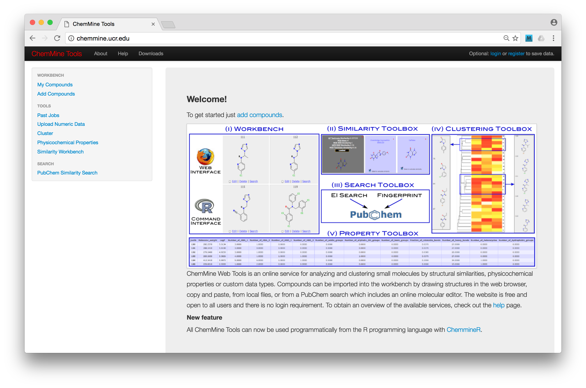
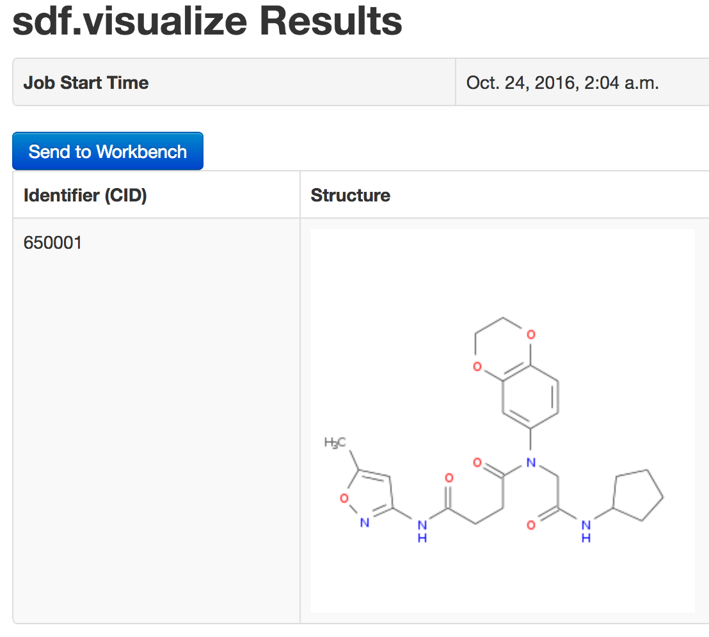

```{r setup, include=FALSE}
knitr::opts_chunk$set(echo = TRUE)
```

This material covers a VERY basic introduction to some of the functionality provided by the `ChemmineR` package for R.

It borrows (very) heavily from: 

 - http://www.bioconductor.org/packages/devel/bioc/vignettes/ChemmineR/inst/doc/ChemmineR.html

### R libraries

The main R package used during this session is `ChemmineR`.  You can install this via:

```{r eval=FALSE}
## Source the biocLite.R installation script
source("http://bioconductor.org/biocLite.R") 

## Use biocLite to install the package
biocLite("ChemmineR") 
```

### Additional complication(s)

Additional functionality can be added to the `ChemmineR` package through the OpenBabel C++ library, accessed via 
the `ChemmineOB` R package.  This provides extra format conversion and local peptide structure viewing capabilities.
As described in the manual, `ChemmineR` will automatically detect whether `ChemmineOB` is installed.  To get 
OpenBabel installed on my (Mac OS) laptop, I used the v2.3.1 zip file from:

http://openbabel.org/wiki/Category:Installation

and then installed the `ChemmineOB` package via:

```{r eval=FALSE}
source("http://bioconductor.org/biocLite.R")
biocLite("ChemmineOB")
```

For comparing compounds, and performing clustering, the `fmcsR` package is needed:

```{r eval=FALSE}
source("http://bioconductor.org/biocLite.R")
biocLite("fmcsR")
```

### References

Papers relating to this package and the assocaited "Chemmine" web service:

 - Cao, Y., Charisi, A., Cheng, L.-C., Jiang, T., & Girke, T. (2008). ChemmineR: a compound mining framework for R. Bioinformatics (Oxford, England), 24(15), 1733–1734. http://doi.org/10.1093/bioinformatics/btn307

 - Backman, T. W. H., Cao, Y., & Girke, T. (2011). ChemMine tools: an online service for analyzing and clustering small molecules. Nucleic Acids Research, 39(suppl), W486–W491. http://doi.org/10.1093/nar/gkr320

Bioconductor page:

 - https://www.bioconductor.org/packages/release/bioc/html/ChemmineR.html

### A name you recognise?

 - Thomas Girke is an Associate Professor in Bioinformatics at UC Riverside:   
       - http://girke.bioinformatics.ucr.edu/
 - He has a great page of R manuals:
       - http://girke.bioinformatics.ucr.edu/manuals/mydoc/home.html
 - Includes a fantastic one covering various Bioconductor functionality that I have 
 used (and referenced) in my STAT435 lectures:
       - http://manuals.bioinformatics.ucr.edu/home/R_BioCondManual
       
### The ChemMine website

The ChemMine website provides a collection of tools for working with structure data from small molecules:
  - drawing structures
  - similarity searching
  - clustering 
  


Even cooler, all of this functionality can be accessed from within R via the ChemmineR package.

#### http://chemmine.ucr.edu/

### ChemmineR: Getting started

Load the ChemmineR library:

```{r}
library(ChemmineR)
```

and the `ChemmineOB` package if you have it installed:

```{r}
library(ChemmineOB)
```

#### Some background: data formats

This data can handle molecular structure data is the following formats:

 - SDF
 - smiles

Let's learn what these formats look like by loading some data.

#### Importing SDF objects

Import some SDF data from Thomas's web page (you can ignore the warning 
about an "incomplete final line"):
```{r, cache=TRUE}
sdfset <- read.SDFset("http://faculty.ucr.edu/~tgirke/Documents/R_BioCond/Samples/sdfsample.sdf") 
```

What sort of data is it?
```{r}
## Class?
class(sdfset)

## Length?
length(sdfset)

## First component?
sdfset[[1]]
```

NB: need to be a little bit careful with accessing the objects (note the different
effect of vector-style _versus_ list-style):

```{r}
class(sdfset[1])
sdfset[1]

class(sdfset[[1]])
sdfset[[1]]
```

This means that `sdf.visualize( sdfset[1] )` will succeed (as it requires a SDFset object),
but `sdf.visualize( sdfset[[1]] )` will fail, since `sdfset[[1]]` is a "SDF", not a 
"SDFset".

What can we do with this information?  Let's try plotting it.  This command:

```{r, eval=FALSE}
## Opens browser window and plots structure using Chemmine web service 
sdf.visualize( sdfset[1] )
```

will open the ChemmineR website and display the first structure in a web browser.  
It should look like this:



If you have the OpenBabel package installed, the following command will plot the
structure in R:

```{r, fig.height=5, fig.width=6}
## With the ChemmineOB package loaded (and OpenBabel installed) you can plot locally:
plot(sdfset[1], regenCoords=TRUE, print=FALSE)
```

You can also plot multiple compounds from a SDFset:
```{r, fig.height=7, fig.width=7}
## With the ChemmineOB package loaded (and OpenBabel installed) you can plot locally:
plot(sdfset[1:4], regenCoords=TRUE, print=FALSE)
```

What about the other (smiles) format?  With OpenBabel, we can do format conversion:

```{r, cache=TRUE}
smileset <- sdf2smiles(sdfset) 
```

What does this format look like?

```{r}
## 
## Display the first smiles object
smileset[[1]]
```

There are also functions for importing (and exporting) smiles data.

## What else can we do?

Who wouldn't want to identify rings?!

```{r}
ringatoms <- rings(sdfset[1], upper=Inf, type="all", arom=FALSE, inner=FALSE)
## What did we get?
ringatoms
```

And plot them! (rings are highlighted in red).
```{r}
atomindex <- as.numeric(gsub(".*_", "", unique(unlist(ringatoms))))
atomindex
plot(sdfset[1], print=FALSE, colbonds=atomindex) 
```

You can even plot the atoms if you want...
```{r}
plot(sdfset[1], print=FALSE, atomnum=TRUE, no_print_atoms="H", colbonds=atomindex) 
```

### Similarity searching

The `fmcsR` package can be use to identify similar substructures between compounds
(i.e., "Maximum Common Substructure": MCS).  The following code loads a new SDFset of
structures (only three), and looks for MCSs between the first two.

```{r}
## Load fmcsR package
library(fmcsR)

## Load SDFset
data(fmcstest)
length(fmcstest)

## Search for MCS (with mismatches)
## au and bu are the upper bonds for atom and bond matches respectively
test <- fmcs(fmcstest[1], fmcstest[2], au=2, bu=1) 

# Plot both query compounds, with MCS in color 
plotMCS(test) 
```

### "Atom Pair" (AP) data format

The "atom pair" (AP) representation that can 
be used for structural similarity searching and clustering.

```{r}
# Create an AP representation for single compound
ap <- sdf2ap(sdfset[[1]]) 

# Create an AP representation for a set of compounds
apset <- sdf2ap(sdfset)
view(apset[1:4])
```

What does this format actually represent?

```{r}
## Raw format
apset[[1]]

## First 6 entries (out of 528) in "human readable" format
head(db.explain(apset[1]))

## Reminder - what does this compund look like?
plot(sdfset[1], print=FALSE)
```

You can use the AP format to calculate the similarity of any pair of molecules:

```{r}
cmp.similarity(apset[1], apset[2])
```

### Similarity searching

Search for compounds in the `apset` object that are similar to the first compound.

```{r}
## Search for compounds similar to CMP1
cmp.search(apset, apset[1], type=3, cutoff = 0.3, quiet=TRUE) 
```

NB: for some reason the following code was giving me multiple errors when running
with `knitr`, but it should be fine in the console.

```{r, eval=FALSE}
## Plot CMP1 and CMP96 (the one most similar to CMP1)
## Note that I am using the SDFset format here
plot(sdfset[c(1,96)], print=FALSE)

## Identify and plot the MCS between CMP1 and CMP96
test <- fmcs(sdfset[1], sdfset[96], au=2, bu=1) 
plotMCS(test) 
```

### Clustering

Duplicate compounds can be identified via the `cmp.duplicated`
function.

```{r}
## Vector format
cmp.duplicated(apset, type=1)

## Data frame format
head( cmp.duplicated(apset, type=2), 25)

## Plot the pairs of identical compounds (60 & 61, 56 & 57)
plot(sdfset[c("CMP60", "CMP61", "CMP56", "CMP57")], print=FALSE) 
```

The `cmp.cluster` function placs compounds into "similarity bins".  Compounds
are placed in the same bin if their similraity score exceeds a threshold.

```{r}
clusters <- cmp.cluster(db=apset, cutoff = c(0.7, 0.8, 0.9), quiet = TRUE)
clusters[1:12,]
```

```{r}
## Are CMP48 adn CMP49 identical?
cmp.duplicated(apset[c(48,49)], type=1)

## What do they look like?
plot(sdfset[c("CMP48", "CMP49")], print=FALSE) 
```

